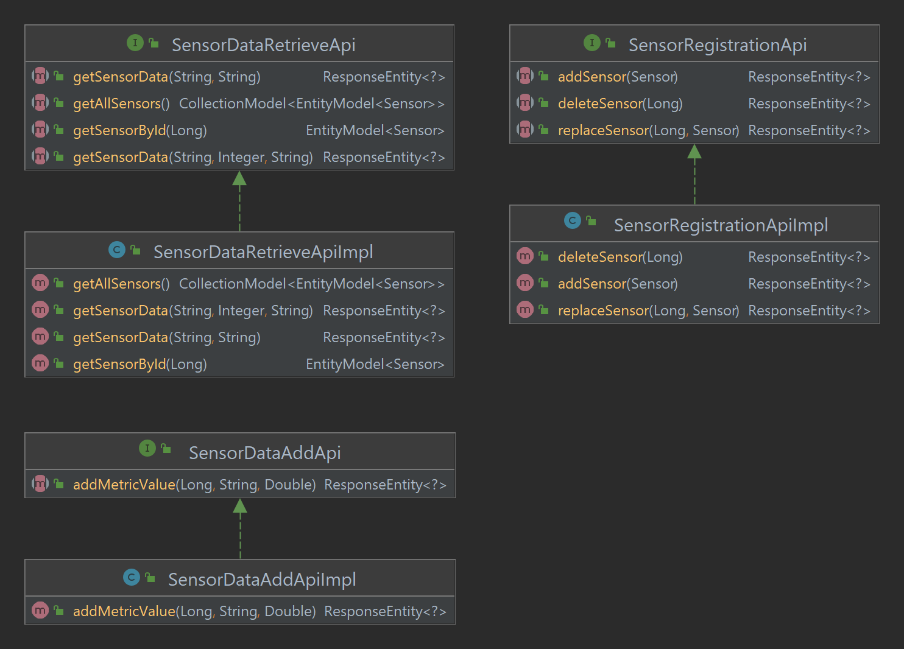

# REST Based Weather Sensor App Build Using Spring Boot

## Introduction

This is a project built using Java and Spring Boot.

The application is a service that allows for the registration of weather sensors. Data relating to each of these weather
sensors can then be added or queried using the exposed REST APIs. The application can receive weather data from various
sensors that report metrics such as temperature, humidity, wind speed, etc.

The application uses the h2 database to store sensor related information, while the REST endpoints were developed using
Spring Boot.

This application exposes three different public APIs:

- [SensorRegistrationApi](./src/main/java/com/dara/restweathersensorapp/api/SensorRegistrationApi.java)
- [SensorDataAddApi](./src/main/java/com/dara/restweathersensorapp/api/SensorDataAddApi.java)
- [SensorDataRetrieveApi](./src/main/java/com/dara/restweathersensorapp/api/SensorDataRetrieveApi.java)

Each public API has a different as their names suggest. Each API endpoint is fully documented in the Javadocs of each of
the interface method signatures. <br />
For a visual representation of the API interfaces and their implementation see the class diagram below:


## How to Run the Project

The project related code can be found in the [src/main/java](./src/main/java) directory of this project. The application
can be started manually by executing the main method in
the [RestWeatherSensorAppApplication](./src/main/java/com/dara/restweathersensorapp/RestWeatherSensorAppApplication.java)
class.

The application is fully tested with unit tests in the [scr/test/java](./src/test/java) directory. Running these tests
will start up the application and run use cases such as sensor registration, data addition and data querying.

For demo purposes there is a [LoadDatabase](./src/main/java/com/dara/restweathersensorapp/LoadDatabase.java) class which
will load the database with sensor data once the main method in
the [RestWeatherSensorAppApplication](./src/main/java/com/dara/restweathersensorapp/RestWeatherSensorAppApplication.java)
class is run. This allows for some manual testing via an internet browser, cURL command, PostMan etc.

#### Query Examples

To get all registered sensors and associated data the [/sensors](http://localhost:8080/sensors
) endpoint should be used. Executing a GET request to this endpoint will return all sensor data:

```
daraf@DESKTOP-KVIV2O6 MINGW64 ~
$ curl http://localhost:8080/sensors
{"_embedded":{"sensorList":[{"sensorId":1,"country":"IE","city":"Mayo","weatherData":[{"weatherMetricTime":"+169087565-03-15T04:51:43.232","weatherMetricName":"humidity","weatherMetricValue":90.0}],"_links":{"self":{"href":"http://localhost:8080/sensor/1"},"sensors":{"href":"http://localhost:8080/sensors"}}},{"sensorId":2,"country":"IE","city":"Galway","weatherData":[{"weatherMetricTime":"+169087565-03-15T04:51:43.232","weatherMetricName":"temperature","weatherMetricValue":33.1}],"_links":{"self":{"href":"http://localhost:8080/sensor/2"},"sensors":{"href":"http://localhost:8080/sensors"}}},{"sensorId":3,"country":"IE","city":"Cork","weatherData":[{"weatherMetricTime":"+169087565-03-15T04:51:43.232","weatherMetricName":"humidity","weatherMetricValue":60.0}],"_links":{"self":{"href":"http://localhost:8080/sensor/3"},"sensors":{"href":"http://localhost:8080/sensors"}}},{"sensorId":4,"country":"IE","city":"Dublin","weatherData":[{"weatherMetricTime":"+169087565-03-15T04:51:43.232","weatherMetricName":"wind-speed","weatherMetricValue":33.1}],"_links":{"self":{"href":"http://localhost:8080/sensor/4"},"sensors":{"href":"http://localhost:8080/sensors"}}},{"sensorId":12,"country":"US","city":"NY","weatherData":[{"weatherMetricTime":"2022-01-02T14:40:36.831947","weatherMetricName":"wind-speed","weatherMetricValue":23.1}],"_links":{"self":{"href":"http://localhost:8080/sensor/12"},"sensors":{"href":"http://localhost:8080/sensors"}}},{"sensorId":13,"country":"US","city":"NJ","weatherData":[{"weatherMetricTime":"2022-01-02T14:40:36.835946","weatherMetricName":"humidity","weatherMetricValue":60.0},{"weatherMetricTime":"2022-01-02T14:40:36.835946","weatherMetricName":"humidity","weatherMetricValue":61.0},{"weatherMetricTime":"2022-01-02T14:40:36.835946","weatherMetricName":"humidity","weatherMetricValue":62.0},{"weatherMetricTime":"2022-01-02T14:40:36.835946","weatherMetricName":"humidity","weatherMetricValue":63.0},{"weatherMetricTime":"2022-01-02T14:40:36.835946","weatherMetricName":"wind-speed","weatherMetricValue":25.1}],"_links":{"self":{"href":"http://localhost:8080/sensor/13"},"sensors":{"href":"http://localhost:8080/sensors"}}}]},"_links":{"self":{"href":"http://localhost:8080/sensors"}}}
```

To get information on a specific sensor the [/sensor/{sensor ID}](http://localhost:8080/sensor/1) endpoint can be used.
Executing a GET request to this endpoint with the ID of a registered sensor will return all data associated with that
sensor:

```
daraf@DESKTOP-KVIV2O6 MINGW64 ~
$ curl http://localhost:8080/sensor/1
{"sensorId":1,"country":"IE","city":"Mayo","weatherData":[{"weatherMetricTime":"+169087565-03-15T04:51:43.232","weatherMetricName":"humidity","weatherMetricValue":90.0}],"_links":{"self":{"href":"http://localhost:8080/sensor/1"},"sensors":{"href":"http://localhost:8080/sensors"}}}
```

To delete a sensor the [/deleteSensor/{sensor ID}](http://localhost:8080/deleteSensor/1) endpoint should be used.
Executing this request with the ID of a registered sensor will remove the sensor and associated data from the database.

```
daraf@DESKTOP-KVIV2O6 MINGW64 ~
$ curl -X DELETE http://localhost:8080/deleteSensor/1
daraf@DESKTOP-KVIV2O6 MINGW64 ~
$ curl http://localhost:8080/sensor/1
{"timestamp":"2022-01-02T15:06:14.924+00:00","status":500,"error":"Internal Server Error","path":"/sensor/1"}
daraf@DESKTOP-KVIV2O6 MINGW64 ~
$ curl http://localhost:8080/sensors
{"_embedded":{"sensorList":[{"sensorId":2,"country":"IE","city":"Galway","weatherData":[{"weatherMetricTime":"+169087565-03-15T04:51:43.232","weatherMetricName":"temperature","weatherMetricValue":33.1}],"_links":{"self":{"href":"http://localhost:8080/sensor/2"},"sensors":{"href":"http://localhost:8080/sensors"}}},{"sensorId":3,"country":"IE","city":"Cork","weatherData":[{"weatherMetricTime":"+169087565-03-15T04:51:43.232","weatherMetricName":"humidity","weatherMetricValue":60.0}],"_links":{"self":{"href":"http://localhost:8080/sensor/3"},"sensors":{"href":"http://localhost:8080/sensors"}}},{"sensorId":4,"country":"IE","city":"Dublin","weatherData":[{"weatherMetricTime":"+169087565-03-15T04:51:43.232","weatherMetricName":"wind-speed","weatherMetricValue":33.1}],"_links":{"self":{"href":"http://localhost:8080/sensor/4"},"sensors":{"href":"http://localhost:8080/sensors"}}},{"sensorId":12,"country":"US","city":"NY","weatherData":[{"weatherMetricTime":"2022-01-02T14:40:36.831947","weatherMetricName":"wind-speed","weatherMetricValue":23.1}],"_links":{"self":{"href":"http://localhost:8080/sensor/12"},"sensors":{"href":"http://localhost:8080/sensors"}}},{"sensorId":13,"country":"US","city":"NJ","weatherData":[{"weatherMetricTime":"2022-01-02T14:40:36.835946","weatherMetricName":"humidity","weatherMetricValue":60.0},{"weatherMetricTime":"2022-01-02T14:40:36.835946","weatherMetricName":"humidity","weatherMetricValue":61.0},{"weatherMetricTime":"2022-01-02T14:40:36.835946","weatherMetricName":"humidity","weatherMetricValue":62.0},{"weatherMetricTime":"2022-01-02T14:40:36.835946","weatherMetricName":"humidity","weatherMetricValue":63.0},{"weatherMetricTime":"2022-01-02T14:40:36.835946","weatherMetricName":"wind-speed","weatherMetricValue":25.1}],"_links":{"self":{"href":"http://localhost:8080/sensor/13"},"sensors":{"href":"http://localhost:8080/sensors"}}}]},"_links":{"self":{"href":"http://localhost:8080/sensors"}}}
```

To query data from a sensor or group of sensors
the [/sensorData/{sensor ID(s)}/{dateRange}/{weatherAttribute}](http://localhost:8080/sensorData/12,13/3/*) endpoint can
be used. This endpoint can receive a variety of arguments, all of
which [are outlined in the Javadoc's of the API's interface.](./src/main/java/com/dara/restweathersensorapp/api/SensorDataRetrieveApi.java)

The example below fetches the average values over the previous 3 days for all weather metrics from the sensors with ID
12 and ID 13:

```
daraf@DESKTOP-KVIV2O6 MINGW64 ~
$ curl http://localhost:8080/sensorData/12,13/3/*
{"12-wind-speed":"23.1","13-wind-speed":"25.1","13-humidity":"61.5"}
```

There is more functionality that this application that what is outlined in the examples above. Each endpoint
across [all three APIs are documented in the Javadocs of the APIs.](./src/main/java/com/dara/restweathersensorapp/api/)

## Incomplete Elements

- The application performs all actions outlined in the specification with one exception. If the date range is not
  supplied the latest data should be queried, but it is not. This is
  mentioned [in a TODO comment in the SensorDataRetrieveApiImpl class.](./src/main/java/com/dara/restweathersensorapp/impl/SensorDataRetrieveApiImpl.java)
  Additionally, there is a unit test written for this method, but it is disabled.

- The application does not have any automated integration tests. The test cases were defined and can be found in
  the [src/test/java/integration/.](./src/test/java/integration/) The unit tests are written and provide a high level of
  coverage (85% line coverage according to Jacoco plugin after excluding RestWeatherSensorAppApplication and
  LoadDatabase classes).